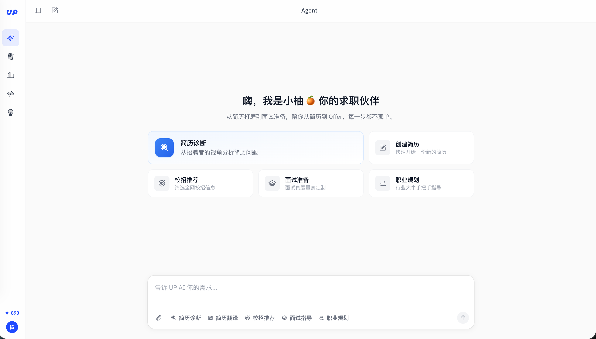
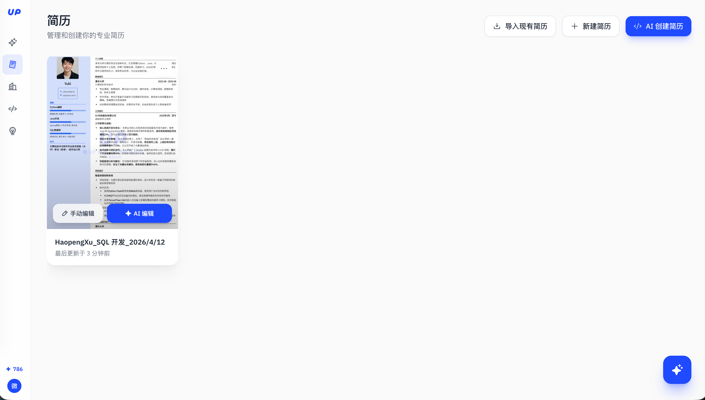
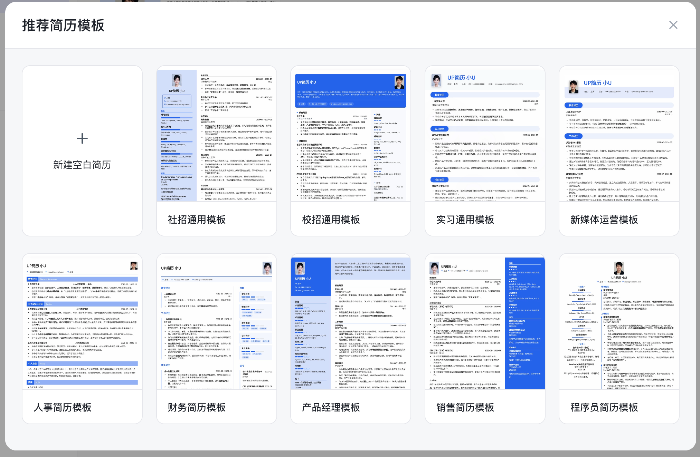
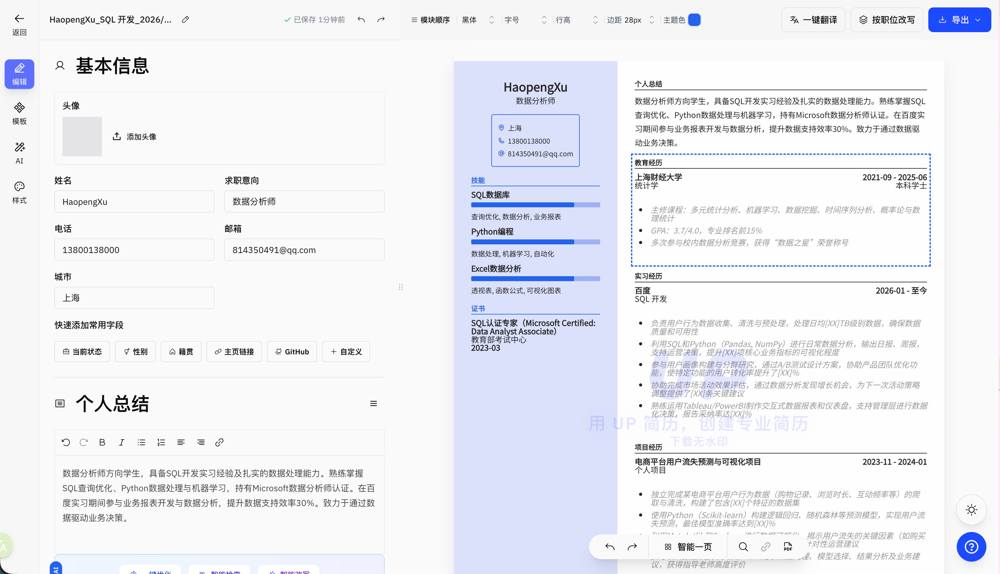
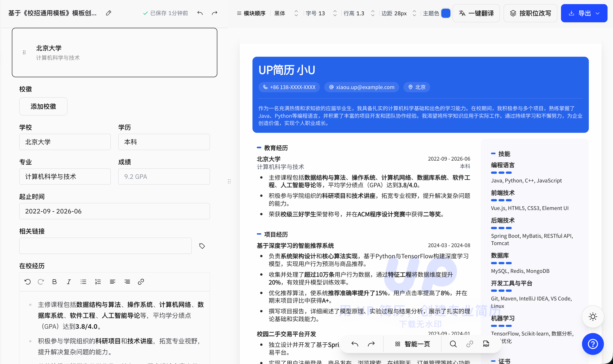

# 欢迎页改版。
 将我们这个欢迎页面改成下面这张图的样式，把原来的那个个欢迎页面就是全部去掉，个人信息放到左下角，供用户去查看和引导。来让用户去查看自己的个人信息，或者编辑自己的个人信息

默认呢，我们先让创建简历这一项可以被点击。 嗯，输入框的话，我希望你能够留下来，就是这个聊天框要留下来，并且这个默认引导文案要和这个图上是一样的。稍后的话，我们会用AGUI的协议来完成这个的功能。
创建简历这一项打开点击之后呢，是跳到了我们的简历列表这一页。

# 简历列表。
那么我们要额外开发一个简历列表的一个功能，就是基于用户维度的简历列表。简历的数据结构其实比较清晰，就是我我会提供给你。然后我们需要有一张新的表来管理这个用户的简历。那个简历的话需要让用户来新建或者是导入。


需要注意到，这个地方会以查询用户所名下的所有的简历。那么这些简历呢，需要用户鼠标在放上去之后，需要有两个东西被看到，就是手动编辑还有是AI编辑啊，这两个用来分流。

现在我来给你大概讨论一下一张简历的数据结构。 嗯，要知道我们是在做一个在线化的一个简历制作平台，那么我们的简历在线化其实是通过，把用户的检验里的标准数据结构给到浏览器，然后让浏览器通过特定的CSS和这种HTML的拼接完成的简历的可视化，对，让一切都变得非常的标准。
```json
[
    {
        "id": "cmnvpq0lv30lip32hryj2rwaw",
        "title": "HaopengXu_SQL 开发_2026/4/12",
        "slug": "v0az2f",
        "data": {
            "basics": {
                "url": {
                    "href": "",
                    "label": ""
                },
                "name": "HaopengXu",
                "email": "814350491@qq.com",
                "phone": "13800138000",
                "picture": {
                    "url": "",
                    "size": 64,
                    "effects": {
                        "border": false,
                        "hidden": false,
                        "grayscale": false
                    },
                    "aspectRatio": 1,
                    "borderRadius": 0
                },
                "headline": "数据分析师",
                "location": "上海",
                "customFields": []
            },
            "metadata": {
                "css": {
                    "value": ".section {\n\toutline: 1px solid #000;\n\toutline-offset: 4px;\n}\n\n.placeholder {\n\tcolor: #aaa !important;\n\tfont-style: italic;\n\topacity: 0.6;\n}",
                    "visible": false
                },
                "page": {
                    "format": "a4",
                    "margin": 28,
                    "options": {
                        "breakLine": true,
                        "pageNumbers": true
                    }
                },
                "notes": "",
                "theme": {
                    "text": "#242424",
                    "primary": "#2563eb",
                    "background": "#fffefe"
                },
                "layout": [
                    [
                        [
                            "profiles",
                            "summary",
                            "education",
                            "experience",
                            "projects",
                            "volunteer",
                            "references"
                        ],
                        [
                            "languages",
                            "skills",
                            "interests",
                            "certifications",
                            "awards",
                            "publications"
                        ]
                    ]
                ],
                "template": "glalie",
                "typography": {
                    "font": {
                        "size": 13,
                        "family": "Noto Sans SC",
                        "subset": "chinese-simplified",
                        "variants": [
                            "regular"
                        ]
                    },
                    "hideIcons": false,
                    "lineHeight": 1.3,
                    "underlineLinks": false
                }
            },
            "sections": {
                "awards": {
                    "id": "awards",
                    "name": "荣誉奖项",
                    "items": [],
                    "columns": 1,
                    "visible": true,
                    "separateLinks": true
                },
                "custom": {},
                "skills": {
                    "id": "skills",
                    "name": "技能",
                    "items": [
                        {
                            "id": "a4dxjh71ugr6j9dwkvpxps1o",
                            "name": "SQL数据库",
                            "level": 4,
                            "visible": true,
                            "keywords": [
                                "查询优化",
                                "数据分析",
                                "业务报表"
                            ],
                            "description": ""
                        },
                        {
                            "id": "eu93x5xi71r46k0z443i48qf",
                            "name": "Python编程",
                            "level": 4,
                            "visible": true,
                            "keywords": [
                                "数据处理",
                                "机器学习",
                                "自动化"
                            ],
                            "description": ""
                        },
                        {
                            "id": "bsqdv656buupz3i3eu78boq4",
                            "name": "Excel数据分析",
                            "level": 4,
                            "visible": true,
                            "keywords": [
                                "透视表",
                                "函数公式",
                                "可视化图表"
                            ],
                            "description": ""
                        }
                    ],
                    "columns": 1,
                    "visible": true,
                    "separateLinks": true
                },
                "summary": {
                    "id": "summary",
                    "name": "个人总结",
                    "columns": 1,
                    "content": "数据分析师方向学生，具备SQL开发实习经验及扎实的数据处理能力。熟练掌握SQL查询优化、Python数据处理与机器学习，持有Microsoft数据分析师认证。在百度实习期间参与业务报表开发与数据分析，提升数据支持效率30%。致力于通过数据驱动业务决策。",
                    "visible": true,
                    "separateLinks": true
                },
                "profiles": {
                    "id": "profiles",
                    "name": "社交主页",
                    "items": [],
                    "columns": 1,
                    "visible": true,
                    "separateLinks": true
                },
                "projects": {
                    "id": "projects",
                    "name": "项目经历",
                    "items": [
                        {
                            "id": "orhy6l0dtvyjkwb8vkbdykfe",
                            "url": {
                                "href": "",
                                "label": ""
                            },
                            "date": "2023-11 - 2024-01",
                            "name": "电商平台用户流失预测与可视化项目",
                            "summary": "<p><ul style=\"color: #999; font-style: italic;\"><li>独立完成某电商平台用户行为数据（购物记录、浏览时长、互动频率等）的爬取与清洗，构建了包含[XX]个特征的数据集</li><li>使用Python（Scikit-learn）构建逻辑回归、随机森林等预测模型，实现用户流失预测，最佳模型准确率达到[XX]%</li><li>利用Matplotlib和Seaborn进行数据可视化，揭示用户流失的关键因素（如购买频率下降、商品浏览减少等），并提出[XX]条针对性运营建议</li><li>撰写项目报告及技术文档，详细记录数据处理、模型选择、结果分析及业务建议，获得指导老师高度评价</li></ul></p>",
                            "visible": true,
                            "keywords": [],
                            "description": "个人项目"
                        }
                    ],
                    "columns": 1,
                    "visible": true,
                    "separateLinks": true
                },
                "education": {
                    "id": "education",
                    "name": "教育经历",
                    "items": [
                        {
                            "id": "o3eo9du54urou3rnykxhzfn9",
                            "url": {
                                "href": "",
                                "label": ""
                            },
                            "area": "统计学",
                            "date": "2021-09 - 2025-06",
                            "score": "",
                            "summary": "<p><ul style=\"color: #999; font-style: italic;\"><li>主修课程：多元统计分析、机器学习、数据挖掘、时间序列分析、概率论与数理统计</li><li>GPA：3.7/4.0，专业排名前15%</li><li>多次参与校内数据分析竞赛，获得“数据之星”荣誉称号</li></ul></p>",
                            "visible": true,
                            "studyType": "本科学士",
                            "institution": "上海财经大学"
                        }
                    ],
                    "columns": 1,
                    "visible": true,
                    "separateLinks": true
                },
                "interests": {
                    "id": "interests",
                    "name": "兴趣爱好",
                    "items": [],
                    "columns": 1,
                    "visible": true,
                    "separateLinks": true
                },
                "languages": {
                    "id": "languages",
                    "name": "语言",
                    "items": [],
                    "columns": 1,
                    "visible": true,
                    "separateLinks": true
                },
                "volunteer": {
                    "id": "volunteer",
                    "name": "社团与组织经历",
                    "items": [
                        {
                            "id": "qwsu8fesm1c2fgn5ljj7ntga",
                            "url": {
                                "href": "",
                                "label": ""
                            },
                            "date": "2022-09 - 2023-09",
                            "summary": "<p><ul style=\"color: #999; font-style: italic;\"><li>组织策划并成功举办[XX]场数据分析技能培训讲座，覆盖Python数据分析、SQL实战、Excel高级应用等主题，累计吸引[XX]名社员参与</li><li>负责社团日常运营与团队管理，带领[XX]人核心团队，有效提升社团活跃度[XX]%</li><li>搭建社团知识分享平台，定期发布行业动态与学习资源，促进社员间的交流与学习</li><li>成功组织校内数据分析竞赛，吸引[XX]支队伍参与，提升了社团在校内的影响力</li></ul></p>",
                            "visible": true,
                            "location": "",
                            "position": "数据科学社社长",
                            "organization": "校数据科学社"
                        }
                    ],
                    "columns": 1,
                    "visible": true,
                    "separateLinks": true
                },
                "experience": {
                    "id": "experience",
                    "name": "实习经历",
                    "items": [
                        {
                            "id": "j4urjpiqp944trxgfye7j5yf",
                            "url": {
                                "href": "",
                                "label": ""
                            },
                            "date": "2026-01 - 至今",
                            "company": "百度",
                            "summary": "<p><ul style=\"color: #999; font-style: italic;\"><li>负责用户行为数据收集、清洗与预处理，处理日均[XX]TB级别数据，确保数据质量和可用性</li><li>利用SQL和Python（Pandas, NumPy）进行日常数据分析，输出日报、周报，支持运营决策，提升[XX]项核心业务指标的可视化程度</li><li>参与用户画像构建与分群研究，通过A/B测试设计方案，协助产品团队优化功能，使特定功能的用户转化率提升了[XX]%</li><li>协助完成市场活动效果评估，通过数据分析发现增长机会，为下一次活动策略调整提供了[XX]条关键建议</li><li>熟练运用Tableau/PowerBI制作交互式数据报表和仪表盘，支持管理层进行数据化决策，报告采纳率达[XX]%</li></ul></p>",
                            "visible": true,
                            "location": "",
                            "position": "SQL 开发"
                        }
                    ],
                    "columns": 1,
                    "visible": true,
                    "separateLinks": true
                },
                "references": {
                    "id": "references",
                    "name": "推荐信",
                    "items": [],
                    "columns": 1,
                    "visible": true,
                    "separateLinks": true
                },
                "publications": {
                    "id": "publications",
                    "name": "出版物",
                    "items": [],
                    "columns": 1,
                    "visible": true,
                    "separateLinks": true
                },
                "certifications": {
                    "id": "certifications",
                    "name": "证书",
                    "items": [
                        {
                            "id": "tnlqpq48nvydg3nculqg9eb6",
                            "url": {
                                "href": "",
                                "label": ""
                            },
                            "date": "2023-03",
                            "name": "SQL认证专家（Microsoft Certified: Data Analyst Associate）",
                            "issuer": "教育部考试中心",
                            "summary": "",
                            "visible": true
                        }
                    ],
                    "columns": 1,
                    "visible": true,
                    "separateLinks": true
                }
            }
        },
        "visibility": "private",
        "locked": false,
        "userId": "cmnvp8o1e02eio52cv9dfa72e",
        "source": "ORIGINAL",
        "language": "CHINESE",
        "sourceResumeId": null,
        "createdAt": "2026-04-12T12:00:59.539Z",
        "updatedAt": "2026-04-12T12:22:09.052Z"
    }
]
```

嗯，注意到我们的简历其实是包含了，像嗯，用户的基础信息，然后包含用户的selections. 以及我们后面要设计的简历模板。


# 新建简历
那么为了让用户能够新增简历，这里的话我们需要新增很多的这种设计模板，就是简历的设计模板，那这个模板其实是通过我们平台来控制的。就是我们作为平台运营方，我们会提前准备好几套的这样的一个模板，供用户在一个新建列表的一个地方可以去查看它的模板。嗯，查看模板之后呢，那我们就会进入到对应的这种，这个模板想渲染好的话，需要填充哪些用户信息的这么的一个表单页。

对应的我们需要让后端来维护这样的一套简历模板的标准信息，然后前端来当用户进入到这个页面的时候来获取这些简历模板。

```json
{
            "id": 1,
            "title": "经典",
            "name": "rhyhorn",
            "preview": "https://oss.upcv.tech/web/template/rhyhorn.jpg",
            "permission": [
                "free"
            ],
            "meta": {
                "css": {
                    "value": ".section {\n\toutline: 1px solid #000;\n\toutline-offset: 4px;\n}",
                    "visible": false
                },
                "page": {
                    "format": "a4",
                    "margin": 28,
                    "options": {
                        "breakLine": true,
                        "pageNumbers": true
                    }
                },
                "notes": "",
                "theme": {
                    "text": "#242424",
                    "primary": "#2563eb",
                    "background": "#fffefe"
                },
                "layout": [
                    [
                        [
                            "education",
                            "profiles",
                            "experience",
                            "projects",
                            "summary",
                            "volunteer",
                            "references"
                        ],
                        [
                            "languages",
                            "skills",
                            "interests",
                            "certifications",
                            "awards",
                            "publications"
                        ]
                    ]
                ],
                "template": "rhyhorn",
                "typography": {
                    "font": {
                        "size": 13,
                        "family": "Noto Sans SC",
                        "subset": "chinese-simplified",
                        "variants": [
                            "regular"
                        ]
                    },
                    "hideIcons": false,
                    "lineHeight": 1.3,
                    "underlineLinks": false
                }
            },
            "columns": 1,
            "isVip": false,
            "description": ""
        }
```


# 手动编辑简历
嗯，其实手动编辑简历和新建简历都是一样的，他们打开的这个页面是一样的，无非是编辑简历的话，会把现在简历已经编辑过后的那个数据结构透传给这个页面，然后来进行提前的渲染。当然了，如果是新建简历的话，那就是什么都没有嘛，等着用户来去慢慢地去填充而已。


嗯，为了方便用户的去使用，那我们整个的这个表单其实是分为左右两个部分，那左边的话其实就是用户的。嗯，传统填写个人信息的这样的一个表单，那右边的话呢，我们就可以用我们用户刚刚刚刚已经选择好的那个简历模板，然后再在我们这个前端页面去做实时化的这个渲染。

并且有一些特殊的点是，我期望右边用户在去预览简历的时候呢，它可以帮我们把右边的每一个模块，其实都可以反向锚定到左边的表单上去。这样的用户啊，这样的话用户可以直接啊，比方说他看到教育经历不合格，那他可以就直接去改这样的一个部分了，就不需要用户左右来回去划了。



对应地我分享一份别人的样例给你 文件路径是 file:///Users/xudemin/Downloads/HaopengXu_SQL%20%E5%BC%80%E5%8F%91_2026_4_12%20-%20Lw3SYN.html

